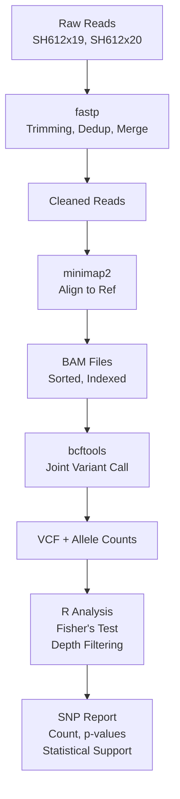

# igrek: Mutant vs Wildtype Genome Comparison

## Goal

Compare two bacterial genome samples (mutant SH612x19 and wildtype SH612x20) to determine whether they differ by zero or one SNP. The analysis uses read-backed allele counts with Fisher's exact test to provide statistical support for the final claim.

---

## Tooling

| Tool | Version | Purpose |
|------|---------|---------|
| **fastp** | 0.23.4 | Quality control, trimming, deduplication, read merging |
| **minimap2** | Latest | Short-read alignment to reference |
| **samtools** | Latest | BAM sorting, indexing, depth queries |
| **bcftools** | Latest | Variant calling and allele-depth extraction |
| **R + tidyverse** | Latest (rocker/tidyverse) | Statistical testing (Fisher's exact test) and reporting |

---

## Workflow



---

## Analysis Steps

### 1. Read Preprocessing (fastp)
- Input: raw Illumina paired-end reads
- Output: cleaned, merged reads with deduplication
- Key settings:
  - `--dedup`: remove duplicate reads
  - `--trim_poly_g`, `--trim_poly_x`: trim low-complexity sequences
  - `--low_complexity_filter`: discard low-complexity reads
  - `--correction`: base correction
  - `--merge`: merge overlapping pairs

### 2. Read Alignment (minimap2 → samtools)
- Index reference genome (minimap2 `-d`)
- Align reads with short-read mode (`-ax sr`)
- Sort and index BAM files
- Output: sorted BAM files with indices

### 3. Variant Calling (bcftools)
- Joint `mpileup` across both samples
- Call variants with `-mv` (multiallelic sites, variants only)
- Extract per-sample allele depths: `CHROM`, `POS`, `REF`, `ALT`, and `AD` (allele depths)

### 4. Statistical Analysis (R)
- **Depth filtering:** minimum 10x coverage per sample
- **Site-wise Fisher's exact test:** test whether alt allele is enriched in one sample
- **Multiple testing correction:** adjust p-values (e.g., Benjamini-Hochberg)
- **Final report:**
  - Count of SNPs passing all filters
  - p-values and adjusted p-values
  - Alt allele frequencies per sample
  - Interpretation: no significant SNPs or list significant sites with evidence

---

## Directory Structure

```
igrek/
├── Dockerfile               # Container definition with all tools
├── docker-compose.yml       # Docker Compose orchestration
├── entrypoint.sh           # Main pipeline script
├── data/
│   ├── raw/                # Input: raw fastq.gz files
│   │   ├── SH612x19_251023_LH00255_A235FKJLT3_R1.fastq.gz
│   │   ├── SH612x19_251023_LH00255_A235FKJLT3_R2.fastq.gz
│   │   ├── SH612x20_251023_LH00255_A235FKJLT3_R1.fastq.gz
│   │   └── SH612x20_251023_LH00255_A235FKJLT3_R2.fastq.gz
│   └── cln/
│       ├── ref/            # Reference genome (downloaded at runtime)
│       │   ├── pa14.fna    # GCF_000014625.1, downloaded from NCBI
│       │   └── pa14.mmi    # minimap2 index (created at runtime)
│       ├── preprocessing/  # fastp outputs (QC reports, cleaned reads)
│       │   ├── SH612x19/
│       │   │   ├── merged.fastq.gz
│       │   │   ├── report.json
│       │   │   └── report.html
│       │   └── SH612x20/
│       │       └── ...
│       ├── assembly/       # skesa outputs (QC only)
│       │   ├── SH612x19/
│       │   │   ├── contigs.fasta
│       │   │   ├── hist.txt
│       │   │   └── connected.txt
│       │   └── SH612x20/
│       │       └── ...
│       ├── mapping/        # Read alignments (BAM files)
│       │   ├── SH612x19.bam
│       │   ├── SH612x19.bam.bai
│       │   ├── SH612x20.bam
│       │   └── SH612x20.bam.bai
│       └── variants/       # Variant calling outputs
│           ├── joint.vcf                    # Joint VCF for both samples
│           └── allele_counts.tsv            # Extracted allele depths
├── src/
│   └── analysis/
│       ├── snp.R                # Legacy (mummer-based, no longer used)
│       └── read_snp_analysis.R  # Read-backed SNP testing (to be created)
└── README.md               # This file
```

---

## Running the Pipeline

```bash
# Build and run the Docker container
docker-compose up --build

# Or manually:
docker build -t igrek:latest .
docker run --rm -v $(pwd)/data:/data -w /data igrek:latest bash /entrypoint.sh
```

All outputs are written to `data/cln/` subdirectories.

---

## Expected Output

After the pipeline completes:

1. **QC Reports:** fastp HTML reports in `cln/preprocessing/SH612x{19,20}/`
2. **Alignments:** indexed BAM files in `cln/mapping/`
3. **Variants:** VCF and allele-count TSV in `cln/variants/`
4. **Statistical Report:** (from R analysis) final SNP count and p-values

---

## Next Steps

1. Create `src/analysis/read_snp_analysis.R` to:
   - Read `cln/variants/allele_counts.tsv`
   - Apply depth filters
   - Run Fisher's exact test per site
   - Produce a final summary table

2. Run the R script:
   ```bash
   Rscript src/analysis/read_snp_analysis.R
   ```

3. Examine the output and write up the results for the collaborator.

---

## Notes

- **Statistical Caveat:** With only one mutant and one wildtype sample, this is not a population-level study. The results describe **read-supported allele enrichment between the two sequenced samples**, not biological replication.
- **Reference Genome:** Downloaded at runtime from NCBI ([GCF_000014625.1](https://ftp.ncbi.nlm.nih.gov/genomes/all/GCF/000/014/625/GCF_000014625.1_ASM1462v1/GCF_000014625.1_ASM1462v1_genomic.fna.gz)). Not stored in the repository.
